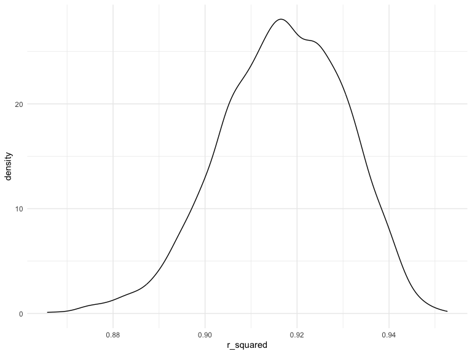
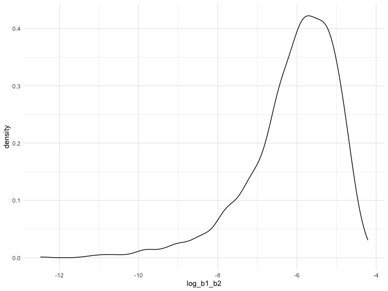

p8105_hw6_rc3520.Rmd
================
Ruyi Chen
2023-11-29

\#Problem 1

``` r
library(modelr)
```

``` r
homicide_df = 
  read_csv("data/homicide-data.csv", na = c("", "NA", "Unknown")) |> 
  mutate(
    city_state = str_c(city, state, sep = ", "),
    victim_age = as.numeric(victim_age),
    resolution = case_when(
      disposition == "Closed without arrest" ~ 0,
      disposition == "Open/No arrest"        ~ 0,
      disposition == "Closed by arrest"      ~ 1)
  ) |> 
  filter(victim_race %in% c("White", "Black")) |> 
  filter(!(city_state %in% c("Tulsa, AL", "Dallas, TX", "Phoenix, AZ", "Kansas City, MO"))) |> 
  select(city_state, resolution, victim_age, victim_sex, victim_race)
```

    ## Rows: 52179 Columns: 12
    ## ── Column specification ────────────────────────────────────────────────────────
    ## Delimiter: ","
    ## chr (8): uid, victim_last, victim_first, victim_race, victim_sex, city, stat...
    ## dbl (4): reported_date, victim_age, lat, lon
    ## 
    ## ℹ Use `spec()` to retrieve the full column specification for this data.
    ## ℹ Specify the column types or set `show_col_types = FALSE` to quiet this message.

``` r
baltimore_glm = 
  filter(homicide_df, city_state == "Baltimore, MD") |> 
  glm(resolution ~ victim_age + victim_sex + victim_race, family = binomial(), data = _)
baltimore_glm
```

    ## 
    ## Call:  glm(formula = resolution ~ victim_age + victim_sex + victim_race, 
    ##     family = binomial(), data = filter(homicide_df, city_state == 
    ##         "Baltimore, MD"))
    ## 
    ## Coefficients:
    ##      (Intercept)        victim_age    victim_sexMale  victim_raceWhite  
    ##         0.309981         -0.006727         -0.854463          0.841756  
    ## 
    ## Degrees of Freedom: 2752 Total (i.e. Null);  2749 Residual
    ## Null Deviance:       3568 
    ## Residual Deviance: 3493  AIC: 3501

``` r
baltimore_glm |> 
  broom::tidy() |> 
  mutate(
    OR = exp(estimate), 
    OR_CI_upper = exp(estimate + 1.96 * std.error),
    OR_CI_lower = exp(estimate - 1.96 * std.error)) |> 
  filter(term == "victim_sexMale") |> 
  select(estimate, OR, OR_CI_lower, OR_CI_upper) |>
  knitr::kable(digits = 3)
```

| estimate |    OR | OR_CI_lower | OR_CI_upper |
|---------:|------:|------------:|------------:|
|   -0.854 | 0.426 |       0.325 |       0.558 |

``` r
model_results = 
  homicide_df |> 
  nest(data = -city_state) |> 
  mutate(
    models = map(data, \(df) glm(resolution ~ victim_age + victim_sex + victim_race, 
                             family = binomial(), data = df)),
    tidy_models = map(models, broom::tidy)) |> 
  select(-models, -data) |> 
  unnest(tidy_models) |> 
  mutate(
    OR = exp(estimate), 
    OR_CI_upper = exp(estimate + 1.96 * std.error),
    OR_CI_lower = exp(estimate - 1.96 * std.error)) |> 
  filter(term == "victim_sexMale") |> 
  select(city_state, OR, OR_CI_lower, OR_CI_upper)

model_results |>
  slice(1:5) |> 
  knitr::kable(digits = 3)
```

| city_state      |    OR | OR_CI_lower | OR_CI_upper |
|:----------------|------:|------------:|------------:|
| Albuquerque, NM | 1.767 |       0.831 |       3.761 |
| Atlanta, GA     | 1.000 |       0.684 |       1.463 |
| Baltimore, MD   | 0.426 |       0.325 |       0.558 |
| Baton Rouge, LA | 0.381 |       0.209 |       0.695 |
| Birmingham, AL  | 0.870 |       0.574 |       1.318 |

In the following visualization, we present a plot depicting the
estimated Odds Ratios (ORs) and Confidence Intervals (CIs) for each
city, arranged in ascending order based on the magnitude of the OR. The
plot reveals a prevalent trend where most cities exhibit odds ratios
below 1. This implies that, even after accounting for victim age and
race, crimes involving male victims tend to have lower odds of
resolution compared to those involving female victims. The observed
disparity is particularly pronounced in New York. Additionally, in
approximately half of these cities, the confidence intervals are narrow
and exclude the value 1, indicating a statistically significant
difference in resolution rates based on gender, even after adjusting for
victim age and race.

``` r
model_results |> 
  ggplot(aes(fct_reorder(city_state,OR),OR)) + 
  geom_point() + 
  geom_errorbar(aes(ymin = OR_CI_lower, ymax = OR_CI_upper)) + 
  theme(axis.text.x = element_text(angle = 90, hjust = 1))
```


\#Problem 2

``` r
weather_df = 
  rnoaa::meteo_pull_monitors(
    c("USW00094728"),
    var = c("PRCP", "TMIN", "TMAX"), 
    date_min = "2022-01-01",
    date_max = "2022-12-31") |>
  mutate(
    name = recode(id, USW00094728 = "CentralPark_NY"),
    tmin = tmin / 10,
    tmax = tmax / 10) |>
  select(name, id, everything())
```

    ## using cached file: /Users/ruyichen/Library/Caches/org.R-project.R/R/rnoaa/noaa_ghcnd/USW00094728.dly

    ## date created (size, mb): 2023-11-30 15:42:32.602751 (8.544)

    ## file min/max dates: 1869-01-01 / 2023-11-30

``` r
view(weather_df)
```

``` r
set.seed(1)
```

``` r
# Define a function to create a bootstrapped sample
boostrap_sample = function(df) {
  sample_frac(df, replace = TRUE)
}

# Generate 5000 bootstrap samples and fit linear regression models
boostrap_result = tibble(number = 1:5000) %>%
  mutate(
    strap_sample = map(number, ~boostrap_sample(weather_df)),
    models = map(strap_sample, ~lm(tmax ~ tmin + prcp, data = .)),
    r2 = map(models, broom::glance),
    results = map(models, broom::tidy)
  ) |>
  select(number, results, r2) |>
  unnest(results, r2) |>
  select(number, estimate, r.squared, term) |>
  pivot_wider(names_from = "term",
    values_from = "estimate" ) |>
  # Calculate and include log transformation of the product of tmin and prcp
  mutate( log_b1_b2 = log(tmin * prcp)) |>
  select(number, r.squared, log_b1_b2)

print(boostrap_result)
```

    ## # A tibble: 5,000 × 3
    ##    number r.squared log_b1_b2
    ##     <int>     <dbl>     <dbl>
    ##  1      1     0.898     -5.44
    ##  2      2     0.928    NaN   
    ##  3      3     0.925    NaN   
    ##  4      4     0.931    NaN   
    ##  5      5     0.915    NaN   
    ##  6      6     0.918     -7.18
    ##  7      7     0.922    NaN   
    ##  8      8     0.910     -6.65
    ##  9      9     0.910     -6.21
    ## 10     10     0.939    NaN   
    ## # ℹ 4,990 more rows

``` r
boostrap_result|>
  janitor:: clean_names()|>
  ggplot(aes(x=r_squared)) +
  geom_density()
```



``` r
boostrap_result |>
  ggplot(aes(x = log_b1_b2)) +
  geom_density()
```



``` r
boostrap_result |>
  janitor::clean_names() |>
  pivot_longer(
    r_squared:log_b1_b2,
    names_to = "estimate",
    values_to = "value"
  ) |>
  group_by(estimate) |>
  summarize(
    ci_lower = quantile(value[!is.na(value)], 0.025),
    ci_upper = quantile(value[!is.na(value)], 0.975)
  ) |>
  knitr::kable(digits = 3)
```

| estimate  | ci_lower | ci_upper |
|:----------|---------:|---------:|
| log_b1_b2 |   -8.982 |   -4.602 |
| r_squared |    0.889 |    0.941 |
